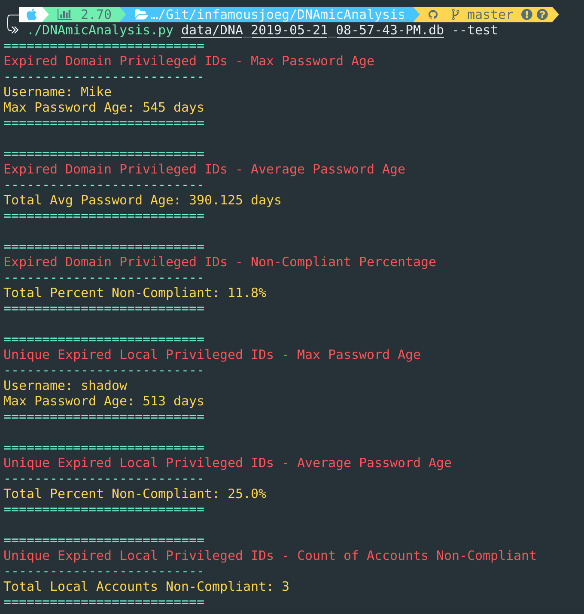

# DNAmic Analysis :bar_chart:

[](https://travis-ci.com/infamousjoeg/DNAmicAnalysis) [](https://www.codacy.com/app/infamousjoeg/DNAmicAnalysis?utm_source=github.com&amp;utm_medium=referral&amp;utm_content=infamousjoeg/DNAmicAnalysis&amp;utm_campaign=Badge_Grade) [](https://www.codacy.com/app/infamousjoeg/DNAmicAnalysis?utm_source=github.com&utm_medium=referral&utm_content=infamousjoeg/DNAmicAnalysis&utm_campaign=Badge_Coverage)

Automation for CyberArk's Discovery & Audit (DNA) reports.

## Installation

```shell
git clone git@github.com/infamousjoeg/DNAmicAnalysis.git
cd DNAmicAnalysis
pip install -r requirements.txt
./DNAmicAnalysis.py --version
```

## Usage

_NOTE: Until a release is available, this is considered a BETA. In a BETA state, the `--test` argument will be default. It will not be required to be provided during this phase. Not displaying output will not help you in anyway._

```shell
$ ./DNAmicAnalysis.py -h
usage: DNAmicAnalysis.py [-h] [--test] [--version] database_file

CyberArk DNA report generation utility

positional arguments:
  database_file  Path to the CyberArk DNA SQLite3 database file

optional arguments:
  -h, --help     show this help message and exit
  --test         For testing purposes only
  --version      Displays current version information
```

## Version

```shell
$ ./DNAmicAnalysis.py --version
DNAmicAnalysis.py (version 0.1.0)
```

## Example Output



## License

MIT
