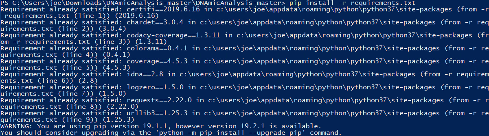
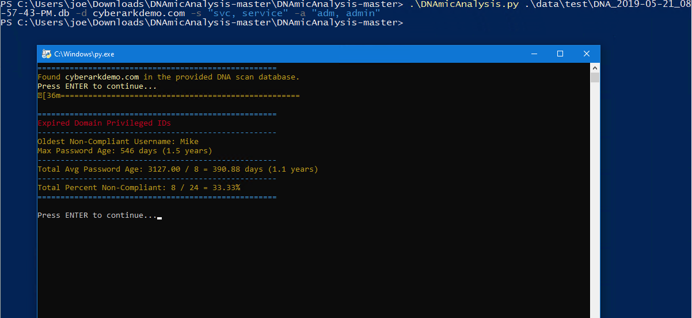

# :bar_chart: DNAmic Analysis <!-- omit in toc -->

[](https://travis-ci.com/infamousjoeg/DNAmicAnalysis) [](https://www.codacy.com/app/infamousjoeg/DNAmicAnalysis?utm_source=github.com&amp;utm_medium=referral&amp;utm_content=infamousjoeg/DNAmicAnalysis&amp;utm_campaign=Badge_Grade) [](https://www.codacy.com/app/infamousjoeg/DNAmicAnalysis?utm_source=github.com&utm_medium=referral&utm_content=infamousjoeg/DNAmicAnalysis&utm_campaign=Badge_Coverage)

 [](https://github.com/infamousjoeg/DNAmicAnalysis/issues) [](https://github.com/infamousjoeg/DNAmicAnalysis/blob/master/LICENSE)

Automation for CyberArk's Discovery & Audit (DNA) deep dive analysis reports.

## Table of Contents <!-- omit in toc -->

- [About](#about)
  - [Project Info](#project-info)
- [IMPORTANT NOTES](#important-notes)
- [Installation](#installation)
  - [Windows](#windows)
  - [Linux](#linux)
    - [RHEL/CentOS](#rhelcentos)
    - [Ubuntu/Debian](#ubuntudebian)
  - [MacOS](#macos)
- [Pre-Requisites](#pre-requisites)
- [Usage](#usage)
  - [Required Parameters](#required-parameters)
  - [Optional Parameters](#optional-parameters)
  - [Output](#output)
- [Version](#version)
- [Example Output](#example-output)
  - [Video Example](#video-example)
  - [Plaintext Example](#plaintext-example)

## About

This project is for the PAS Programs Office of [CyberArk](https://cyberark.com).  It is open-sourced for anyone to utilize, however it is _strongly recommended_ for customers to reach out to your CyberArk Account Team or people without CyberArk to reach out via [CyberArk.com](https://cyberark.com) for a proper deep dive analysis and presentation.

### Project Info

DNAmic Analysis is a command-line application written in Python 3 for OS independence.

The metrics presented from this application were chosen based on deep dive analysis presentations the PAS Programs Office conducts on a frequent basis.  If you have a metric you'd like added, please feel free to add it to this codebase by opening a Pull Request to have your contribution added.

The metrics reported in this application are based on SQL queries ran on the DNA SQLite3 database produced during its scans.  An unmodified DNA SQLite3 database is required for this application to work.  If your DNA SQLite3 database filename is modified, you will receive an error and warning to correct it.

## IMPORTANT NOTES

* Make sure you run DNA.exe as Administrator when scanning.  This ensures the DNA database file is saved properly with timestamping.
* The filename DNA.db **will not work.**
* If you receive a DNA.db file, modify the filename to the following format: `DNA_year-month-day_12hr-min-sec-AMPM.db`
  * e.g. `DNA_2019-05-30_10-31-22-PM.db`

## Installation

### Windows

1. Download & install the latest version of [Python 3](https://www.python.org/downloads/) for Windows.

   **Note:** _If endpoint security is installed, download the **Windows x86-64 embeddable zip file** to bypass privilege escalation requirements._
2. Download the source code zip of the [latest DNAmic Analysis release](https://github.com/infamousjoeg/DNAmicAnalysis/releases).
3. Unpack the source code zip file and start a command prompt from within the directory.

   **Note:** _Holding `Shift` while right-clicking will bring up a context menu with the option "Open Command Prompt here"._
4. `pip install -r requirements.txt`

   

5. Run the application with valid arguments as outlined in the [Usage](#usage) section below. 

   

### Linux

#### RHEL/CentOS

1. Install EPEL Release repository.
   
   `$ sudo yum install epel-release -y`

2. Install Python 3.6 from EPEL.
   
   `$ sudo yum install python36 -y`

3. Install PIP for Python 3.6.
   
   `$ sudo python36 -m ensurepip`

4. Upgrade PIP to latest version.
   
   `$ python36 -m pip install --upgrade pip`
   
5. Clone GitHub repository for DNAmic Analysis.
   
   `$ git clone https://github.com/infamousjoeg/DNAmicAnalysis.git`
   
6. Change directory to newly cloned GitHub repo directory.
   
   `$ cd DNAmicAnalysis/`
   
7. Install requirements.txt dependencies. 
   
   `$ python36 -m pip install -r requirements.txt`

8. Run DNAmicAnalysis with proper arguments as outlined in the [Usage](#usage) section below.
   
   `$ python36 DNAmicAnalysis data/test/DNA_time_date.sql -d domain.com -s "svc, service" -a "adm, admin"`

#### Ubuntu/Debian

1. Install Python 3.6.
   
   `$ sudo apt install python3.6 -y`

2. Install PIP for Python 3.6.
   
   `$ sudo python36 -m ensurepip`

3. Upgrade PIP to latest version.
   
   `$ python36 -m pip install --upgrade pip`
   
4. Clone GitHub repository for DNAmic Analysis.
   
   `$ git clone https://github.com/infamousjoeg/DNAmicAnalysis.git`
   
5. Change directory to newly cloned GitHub repo directory.
   
   `$ cd DNAmicAnalysis/`
   
6. Install requirements.txt dependencies. 
   
   `$ python36 -m pip install -r requirements.txt`

7. Run DNAmicAnalysis with proper arguments as outlined in the [Usage](#usage) section below.
   
   `$ python36 DNAmicAnalysis data/test/DNA_time_date.sql -d domain.com -s "svc, service" -a "adm, admin"`

### MacOS

1. Install Python 3.7.4.

   `$ brew install python`

2. Clone GitHub repository for DNAmic Analysis.
   
   `$ git clone https://github.com/infamousjoeg/DNAmicAnalysis.git`
   
5. Change directory to newly cloned GitHub repo directory.
   
   `$ cd DNAmicAnalysis/`
   
6. Install requirements.txt dependencies. 
   
   `$ pip install -r requirements.txt`

7. Run DNAmicAnalysis with proper arguments as outlined in the [Usage](#usage) section below.
   
   `$ ./DNAmicAnalysis data/test/DNA_time_date.sql -d domain.com -s "svc, service" -a "adm, admin"`

## Pre-Requisites

* [Python 3.x.x](https://www.python.org/downloads/)
* Application dependencies installed
  * `$ pip3 install -r requirements.txt`
* An unchanged DNA SQLite3 database file
  * Please do not change the filename after it is created after a scan
  * Please do not obfuscate the database file
  * In order to save the SQLite3 database, adjust the following key/value pair:
    * Open `dna.exe.config` for editing:

      `DeleteDB=yes`

## Usage

_NOTE: Until a release is available, this is considered a BETA. In a BETA state, the `--output`/`-o` argument will be default. It will not be required to be provided during this phase. Attempting to not display output will not help you in anyway.  Your attempts are futile._

`./DNAmicAnalytics path/to/DNA_date_time.db --domain cyberarkdemo.com --svc-regex "svc, service" --adm-regex "adm, a_, _a, admin"`


### Required Parameters

* `database_file` - the SQLite3 database file should have an unaltered filename.  **This application relies on the date and time stamped in the filename for metrics.**
* `--domain`, `-d` - this **MUST** match an Active Directory domain name that was included in the DNA scan.
* `--svc-regex`, `-s` - this is a quote-encapsulated, comma-delimited list of regex terms denoting a service account.  See [Example Output](#Example-Output) for an example.
* `--adm-regex`, `-a` - this is a quote-encapsulated, comma-delimited list of regex terms denoting an administrator account.  See [Example Output](#Example-Output) for an example.

### Optional Parameters

* `-h`, `--help` - displays the available arguments for this application
* `--output`, `-o` - **Enabled by default while in BETA***.  This displays the metrics to the console.
* `--disabled` - Include all disabled accounts in the metrics.  Disabled accounts are not included by default.
* `--version`, `-v` - Reports the version of this application
* `--test`, `-t` - Suppresses the "Press ENTER to continue" requirement of `--output`, `-o` for automated testing

### Output

If the argument `--output` is passed, the metrics will be output to STDOUT on the console.  In addition, an Excel workbook in .xls format will be created and will contain the bulk data of the metrics' output.  The file is created in the same directory that the `DNAmicAnalysis` executable is run from.

The format for the Excel filename is `DNAmicAnalysis_<domain>_<date>_<time>.xls`.

## Version

```shell
$ ./DNAmicAnalysis --version
DNAmicAnalysis (version 0.3.0-beta.2)
```

## Example Output

### Video Example

[](https://asciinema.org/a/261071)

### Plaintext Example

```plaintext
$ ./DNAmicAnalysis data/test/DNA_2019-05-21_08-57-43-PM.db --domain cyberarkdemo.com --svc-regex "svc, service" --adm-regex "adm, admin"
====================================================
Expired Domain Privileged IDs
----------------------------------------------------
Oldest Non-Compliant Username: Mike
Max Password Age: 546 days
----------------------------------------------------
Total Avg Password Age: 3127.00 / 8 = 390.88 days
----------------------------------------------------
Total Percent Non-Compliant: 8 / 24 = 33.33%
====================================================

Press ENTER to continue...

====================================================
Unique Expired Local Privileged IDs
----------------------------------------------------
Oldest Non-Compliant Username: shadow
Max Password Age: 514 days
----------------------------------------------------
Total Avg Password Age: 932.00 / 3 = 310.67 days
----------------------------------------------------
Total Percent Non-Compliant: 3 / 12 = 25.00%
====================================================

Press ENTER to continue...

====================================================
Expired Local Admins Total w/ Machine Addresses
----------------------------------------------------
Machine Address: client.CyberArkDemo.com
Username: shadow
----------------------------------------------------
Machine Address: epmsvr.CyberArkDemo.com
Username: LocalAdmin
----------------------------------------------------
Machine Address: components.CyberArkDemo.com
Username: Administrator
----------------------------------------------------
Total Local Accounts Non-Compliant: 3 / 12
====================================================

Press ENTER to continue...

====================================================
Local Abandoned / Leftover Accounts
----------------------------------------------------
Total Detected: 0 / 12
====================================================

Press ENTER to continue...

====================================================
Domain Abandoned / Leftover Accounts
----------------------------------------------------
Total Detected: 0 / 24
====================================================

Press ENTER to continue...

====================================================
Accounts with Multiple Machine Access
----------------------------------------------------
60-70% Access
----------------------------------------------------
Username: Administrator
Username: Contractor_1
Username: Contractor_2
Username: g_s_admin
Username: g_x_admin
Username: h_admin
Username: John_Admin
Username: Mike
Username: pta_monitor
Username: reconcile
Username: Robert
Username: rogueadmin
Username: s_admin
Username: svc_bizapp
Username: svc_mgmt
Username: svc_sched
Username: svc_sql
Username: svc_webapp
Username: u_admin
Username: Vendor_1
Username: Vendor_2
Username: x_admin
TOTAL ACCOUNTS: 22
====================================================
40-50% Access
----------------------------------------------------
Username: John
TOTAL ACCOUNTS: 1
====================================================

Press ENTER to continue...

====================================================
Unique Domain Admins
----------------------------------------------------
Total Detected: 22
----------------------------------------------------
Total Potential Service Accounts: 6
====================================================

Press ENTER to continue...

====================================================
Unique Expired Domain Admins
----------------------------------------------------
Oldest Non-Compliant Username: Administrator
Max Password Age: 398 days
----------------------------------------------------
Total Avg Password Age: 3127.0 / 8 = 390.88 days
----------------------------------------------------
Total Percent Non-Compliant: 8 / 22 = 36.36%
====================================================

Press ENTER to continue...

====================================================
Personal Accounts Running Services
----------------------------------------------------
Total Personal Accounts: 1
====================================================

Press ENTER to continue...

====================================================
Non-Admin Accounts w/ Local Admin to Systems
----------------------------------------------------
Total Non-Admin Accounts: 23
====================================================

Press ENTER to continue...

====================================================
Unique Expired Services
----------------------------------------------------
Oldest Non-Compliant Service: Mike
Max Password Age: 546 days
----------------------------------------------------
Total Avg Password Age: 935 / 2 = 467.50 days
----------------------------------------------------
Total Percent Non-Compliant: 2 / 6 = 33.33%
====================================================

Press ENTER to continue...

====================================================
Clear Text IDs
----------------------------------------------------
No Clear Text IDs found.
====================================================

Press ENTER to continue...

====================================================
Applications with Clear Text Passwords
----------------------------------------------------
No Applications with Clear Text Passwords found.
====================================================

Press ENTER to continue...

====================================================
Risky Expired Service Principal Names (SPN)
----------------------------------------------------
Total Unique Expired over Total Overall: 1 / 1
====================================================

Press ENTER to continue...

====================================================
Hashes Found on Multiple Machines
----------------------------------------------------
Total Unique Accounts over Total Found Overall: 5 / 8
----------------------------------------------------
Total Workstations Found: 0
Total Servers Found: 8
====================================================

Press ENTER to continue...

====================================================
Accounts with Multiple Machine Access
----------------------------------------------------
60-70% Access
----------------------------------------------------
Username: Administrator
Username: Contractor_1
Username: Contractor_2
Username: g_s_admin
Username: g_x_admin
Username: h_admin
Username: John_Admin
Username: Mike
Username: pta_monitor
Username: reconcile
Username: Robert
Username: rogueadmin
Username: s_admin
Username: svc_bizapp
Username: svc_mgmt
Username: svc_sched
Username: svc_sql
Username: svc_webapp
Username: u_admin
Username: Vendor_1
Username: Vendor_2
Username: x_admin
TOTAL ACCOUNTS: 22
====================================================
40-50% Access
----------------------------------------------------
Username: John
TOTAL ACCOUNTS: 1
====================================================

Press ENTER to continue...
```